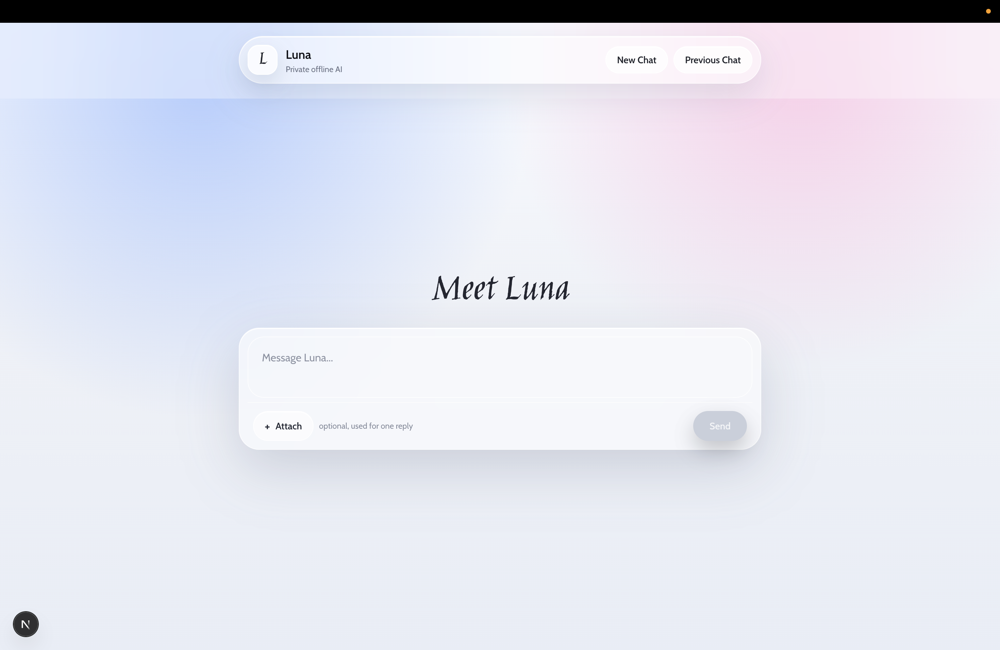

# Luna - Offline AI Assistant

Luna is an offline AI assistant that runs completely on your local machine using a Large Language Model (LLM).

## Preview



## Why I Built This

Most AI assistants need an internet connection. While learning AI, I often faced network issues, making it difficult to use online AI tools. So, I built **Luna**, an offline AI assistant that works locally without relying on the internet.

## Tech Stack

| Technology | Purpose           |
| ---------- | ----------------- |
| Python     | Backend           |
| Streamlit  | User Interface    |
| Ollama     | Local LLM Runtime |
| Llama 3    | Language Model    |

## Features

| Feature   | Description                          |
| --------- | ------------------------------------ |
| Offline   | Works without an internet connection |
| Local     | Runs entirely on your device         |
| Private   | Conversations stay on your system    |
| Simple UI | Easy-to-use chat interface           |

## Run Locally

```bash
git clone https://github.com/rutuja2005byte/Offline-LLM.git
cd Offline-LLM
pip install -r requirements.txt
ollama run llama3
streamlit run app.py
```

## Future Improvements

* Voice support
* Chat history
* Multiple LLM support

## Author

**Rutuja Darade**

GitHub: https://github.com/rutuja2005byte
